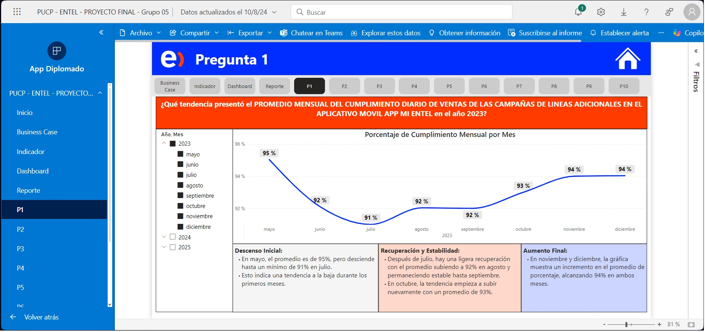
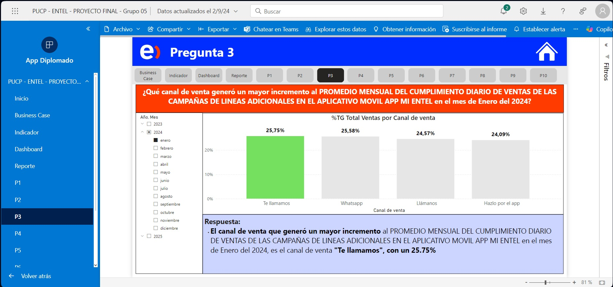
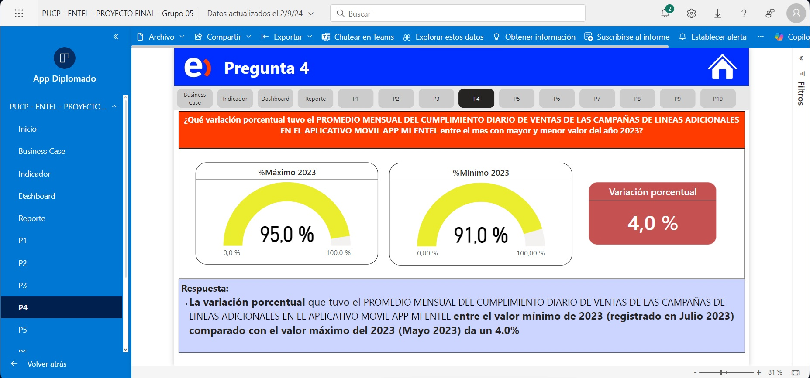
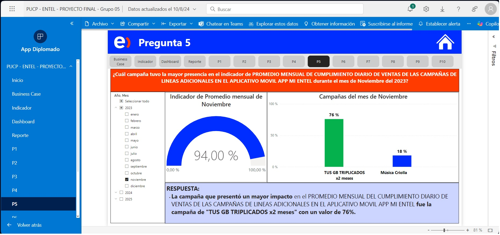
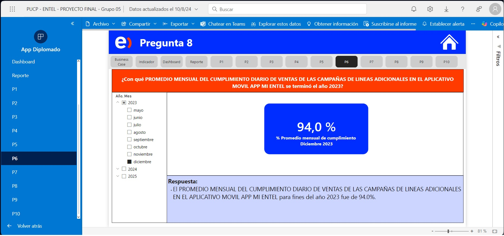
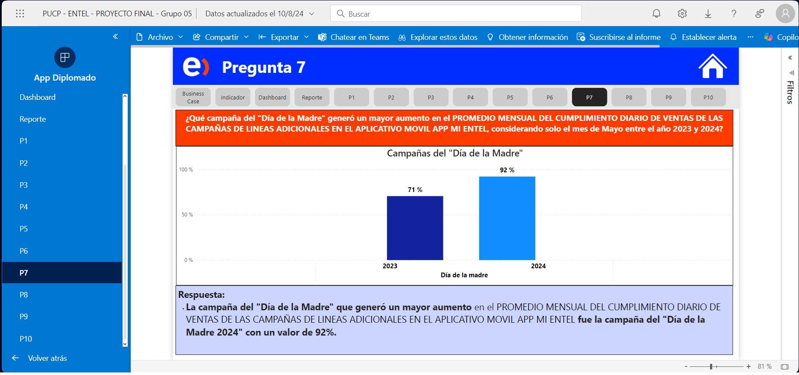
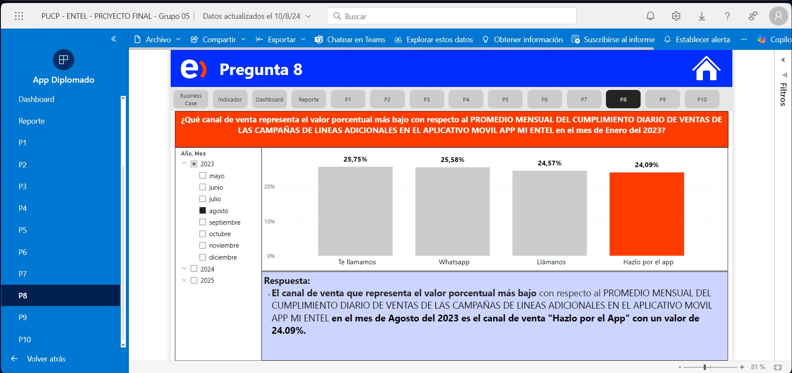

# Proyecto Final

Este es un proyecto grupal del curso de Data Visualization for Power BI correspondiente al Diplomado en Business Analytics de la Pontificia Universidad Católica del Perú.

### Business Case

Como punto de partida para este proyecto, hemos definido como caso de negocio el indicador de "Promedio mensual de ventas diarias de líneas adicionales en el aplicativo móvil APP - MI ENTEL", el cual deberá estar reflejado en una aplicación de Power BI que nos permita darnos claridad para una correcta toma de decisiones.

En esta primera imagen podemos tener una vista de la aplicación de Power BI en donde se nos indica lo siguiente

- Objetivo
- Estrategia
- Costo Beneficio

### Definición del Indicador

Aquí definimos cuál va a ser la métrica que vamos a utilizar para el caso de negocio, además de lo siguiente:

- Nombre del indicador
- Fórmula para el cálculo del indicador
- Metas del indicador y semaforización
- Impacto económico de cada punto porcentual

### Dashboard

En esta pestaña buscamos brindar un estatus de cómo está nuestro promedio mensual para el mes de Mayo 2023, el cual nos servirá como punto de partida para el despliegue de nuestra estrategia de Cross Selling, definida anteriormente. Como podemos apreciar, para el mes de actualización, se llegó a una meta del 93% el cual

### Preguntas 

- **Pregunta 1**: **¿Qué tendencia presentó el indicador de cumplimiento mensual en el año 2023?**

- **Pregunta 2**: **¿Cuál es la difertencia porcentual con respecto al indicador de cumplimiento mensual, comparando el mes de Mayo del año 2023 y 2024?**

- **Pregunta 3**: **¿Qué canal de venta generó un mayor incremento al indicador de cumplimiento mensual en el mes de Enero del 2024?**

- **Pregunta 4**: **¿Qué variación porcentual tuvo el indicador de cumplimiento mensual entre el mes con mayor y menor valor del año 2023?**

  
- **Pregunta 5**: **¿Qué campaña generó un mayor aumento en el indicador de cumplimiento mensual en el mes de Noviembre del año 2023 - con respecto al mes anterior?**

- **Pregunta 6**: **¿Con qué promedio de cumplimiento mensual terminó el año 2023?**

- **Pregunta 7**: **¿Qué campaña del "Día de la Madre" generó un mayor aumento en el indicador de cumplimiento mensual entrel el año 2023 y 2024?**

- **Pregunta 8**: **¿Qué canal de venta representa el valor porcentual más bajo con respecto al indicador de cumplimiento mensual en el mes de Agosto del 2023?**

  
- **Pregunta 9**: **¿Qué valor porcentual del indicador de cumplimiento mensual representa el canal de "WhatsApp" en el mes de Enero del 2024?**

- **Pregunta 10**: **¿Cuál es el mes que tiene el Promedo mensual del cumplimiento diario diario de ventas de las campañas de líneas adicionales en el Aplicativo Movil APP MI ENTEL más cercano a la meta de 100% en el 2024?**

## Creación de Tablas SQL

La ingesta de la data necesaria para este análisis se realizó en SQL Server. 

El diagrama de base de datos utilizado para este proyecto es el sigiuiente:

En código para la creación está en el siguiente enlace: 

